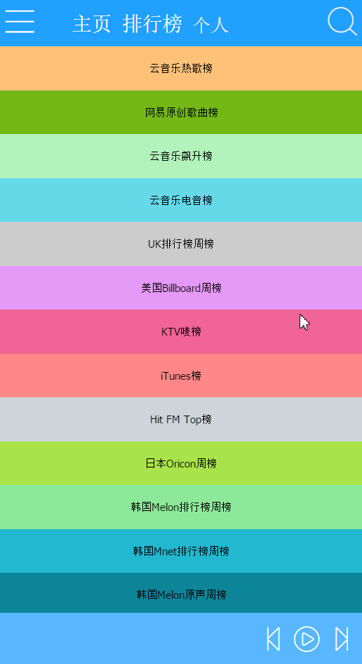
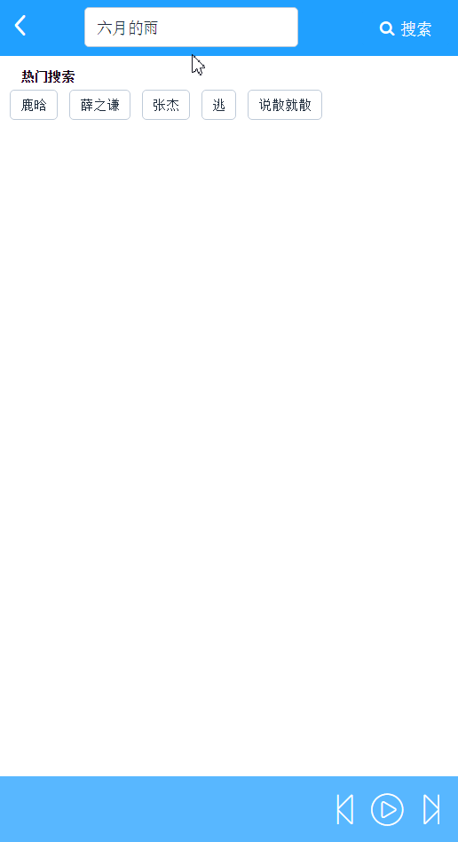
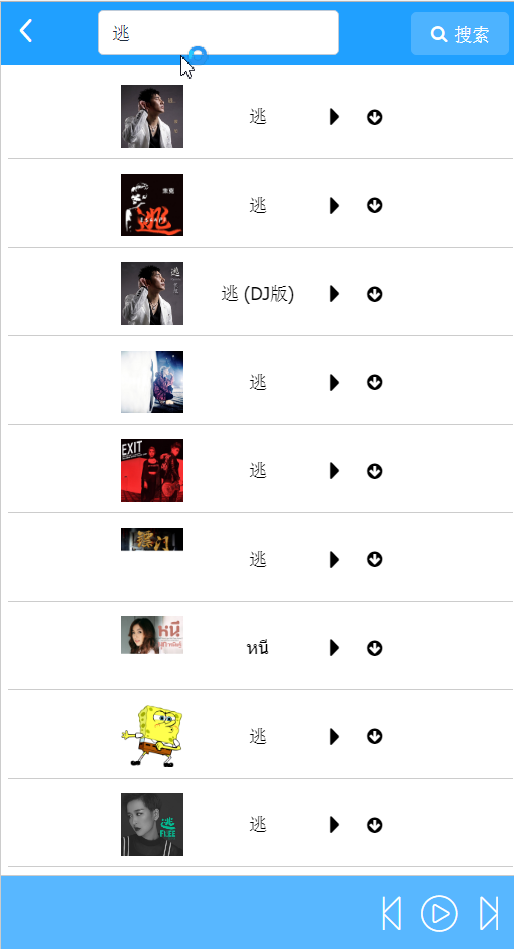

# fenge-music

> A Vue.js project
项目地址:http://huangwufeng.cn
## Build Setup

``` bash
# install dependencies
npm install
#必须按照 loader
npm install stylus stylus-loader style-loader --save-dev
# serve with hot reload at localhost:8080
npm run dev

# build for production with minification
npm run build

# build for production and view the bundle analyzer report
npm run build --report
```
部分界面截图





For detailed explanation on how things work, checkout the [guide](http://vuejs-templates.github.io/webpack/) and [docs for vue-loader](http://vuejs.github.io/vue-loader).
